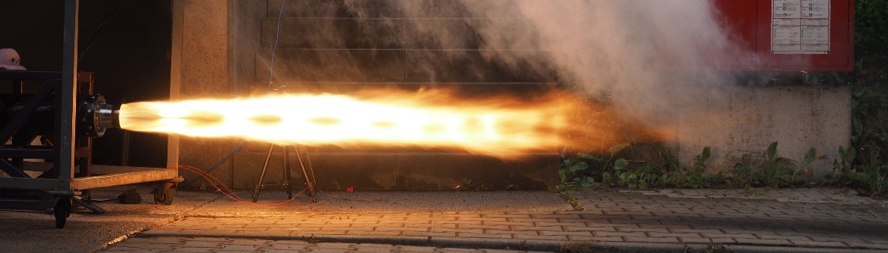

  
   
  <i>Phoenix hotfire · ASTRA Bremen, 2024</i>

  
  

Space Engineering student from Germany with a love for mechatronics problems.
I like fast paced projects where mechanics, electronics and software come together.

At the student rocketry team [ASTRA Bremen](https://www.astra-bremen.com) I work on ground systems: the equipment we use to test, fuel and launch our hybrid rockets.
That also means joining our hotfire and launch campaigns.

### Some things I've worked on

- **[G-code generator for our winding machine](https://github.com/Astra-Bremen/Winding_Machine)**: A Python script that calculates the winding geometry, generates the G-code and shows a preview of the toolpath. It can also insert pauses into the program automatically.
- **Filament winding machine**: A 6 m machine for winding CFRP parts, running on Klipper for CNC. I worked on the motion system, electronics, firmware and calibration.
- **Test stand cameras**: Cameras, network and a recording server to watch and record our hotfire tests, plus an automatic trigger that takes DSLR photos of the engine firing.
- **Nitrous bottle stand**: A mobile stand that holds nitrous bottles upside down, so the rocket can be filled with liquid instead of gaseous N₂O.
- **Voron 2.4 toolchanger**: My own 3D printer with several toolheads for different nozzles and flow rates, a pull-out drawer and a modified Nevermore filter. Still a work in progress.

### Tools

  <!-- TODO: add your CAD tool here, e.g. Fusion 360 / SolidWorks / CATIA / Siemens NX -->
  
  
  
  
  
  

